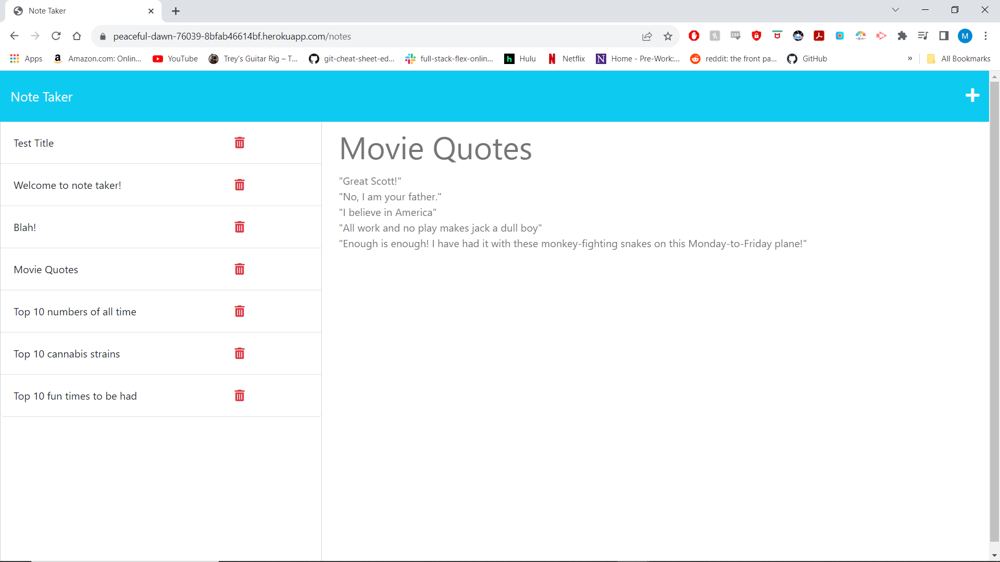

# hw11-note-taker
note taker assignment

## Contents
  * [Description](#Description)
  * [Installation](#installation)
  * [Usage](#usage)
  * [Licenses](#licenses)
  * [Contributing](#contributing)
  * [Tests](#tests)
  * [Questions](#questions)
  * [Repo Link](#repolink)
  * [Screenshot](#screenrecording)
  * [Resources](#resources)

## Description 

This is a express.js application that allows a user to take notes and have them saved to or removed from a database.

## Installation 

Simply clone the repository in your terminal. Package Json and all other relevant modules are already installed and present in the folder.

## Usage

This app is designed to take notes. In order to run this application, user must open the terminal, navigate to the file, and write the command 'node server.js'. The terminal will populate a link to the local host. This link opens in the default browser and displays the application.

## License

## Tests

No test file in the app. If you wish to create a test, simply make a test file and describes different notes you want to test for.

## Questions

Any questions about the app, you may email the developer: blaulmax@gmail.com

## Repo Link

https://peaceful-dawn-76039-8bfab46614bf.herokuapp.com/notes

https://github.com/maxblaul/hw11-note-taker-maxblaul

Not sure if this one is required but I'm going to include it in here anyway:

https://maxblaul.github.io/hw11-note-taker-maxblaul/

## Screenshot 

## Resources

Class notes. 
I had some help from TA Sam Adams to set up boiler plate of server.js. 
Looked at some youtube videos for strucutre and syntax help. This one was the most helpful/utilized:
https://youtu.be/SccSCuHhOw0?si=q27FXKZGuhm8fvv1. 

Used ChatGpt to screen for syntax typos.

